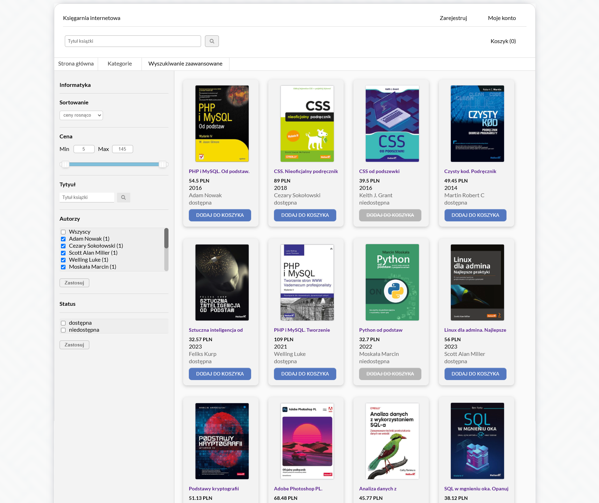
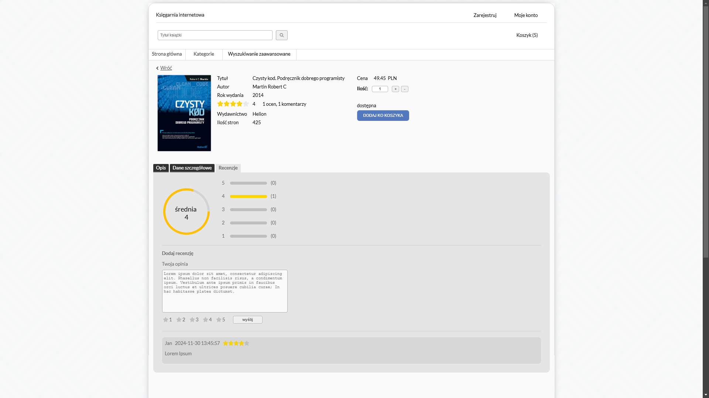
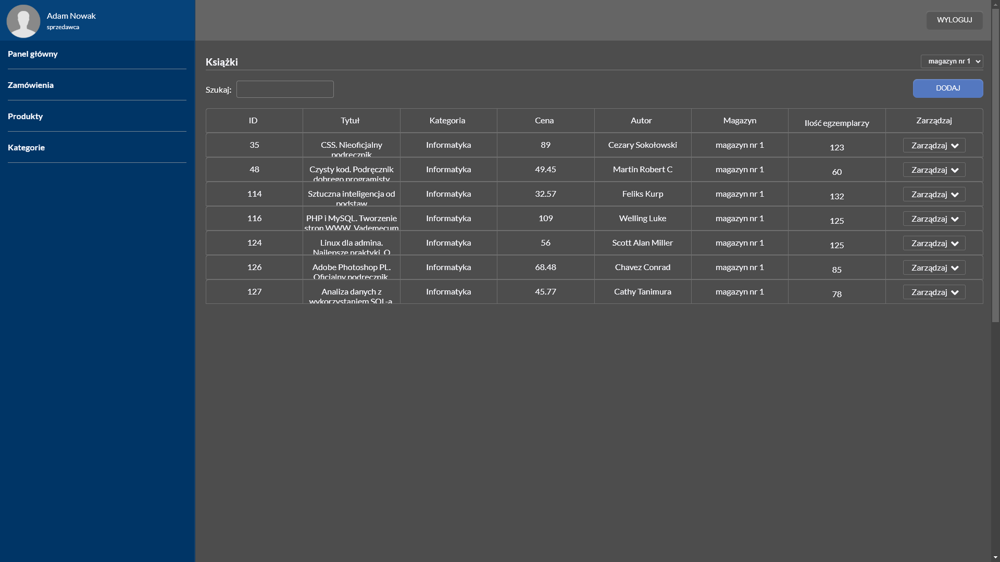
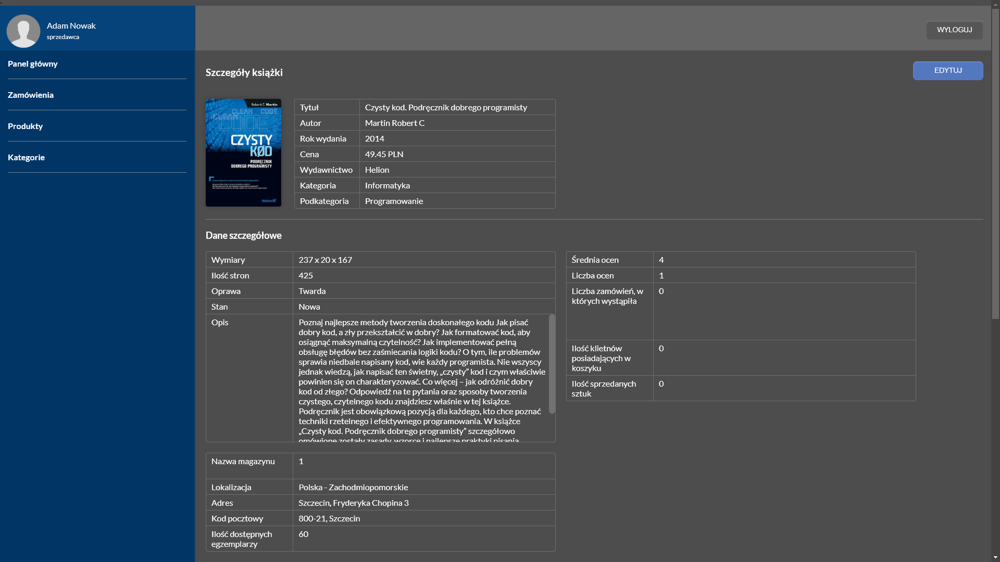

Online bookstore web application Project

<h3>How to install project on localhost:</h3>

1. Install XAMPP
2. Open phpmyadmin (http://localhost:8080/phpmyadmin/)
3. Create new database named "bookstore" with "utf8_polish_ci" encoding
4. Import database from "bookstore.sql" into "bookstore" database

Main page:

Book page:

Admin panel:

